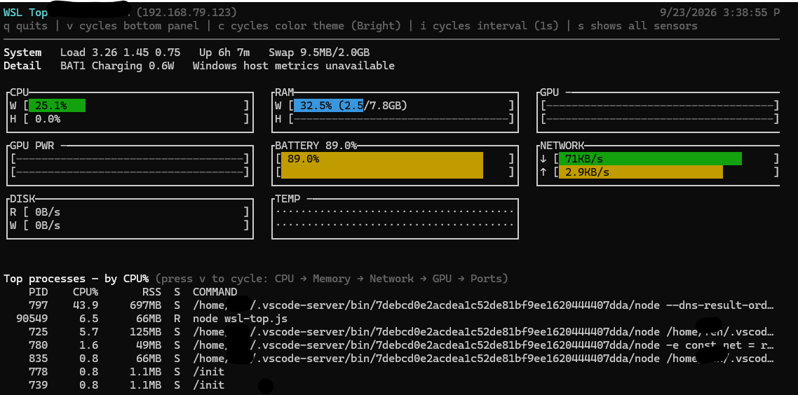
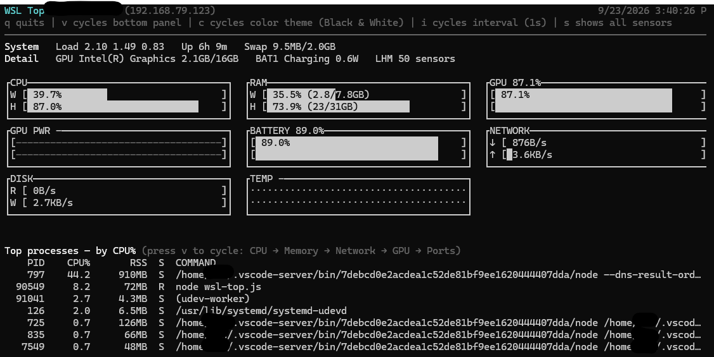
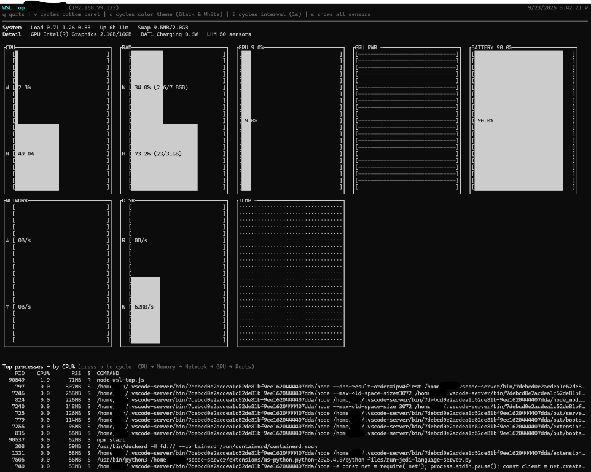
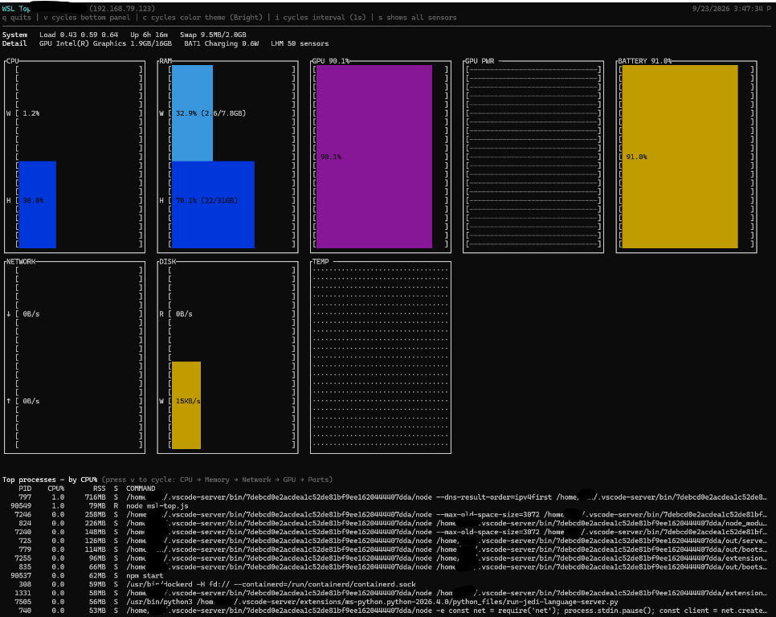

# WSL Top

[WSL (Windows Subsystem for Linux)](https://learn.microsoft.com/windows/wsl/about) lets you run a real Linux environment — including most command-line tools, utilities, and apps — directly on Windows, without a separate VM or dual-boot. WSL Top is a [mactop](https://github.com/context-labs/mactop)-inspired, `htop`/`btop`-style terminal dashboard built specifically for that environment: it shows Linux-side metrics from inside WSL alongside Windows host metrics (CPU, RAM, and optionally full sensor data), all in one live view.

Zero-npm-dependency terminal monitor for WSL — no packages to install, just Node.js built-ins. Full host sensor coverage (GPU/iGPU utilization, fan speeds, voltage rails, accurate CPU package temperature, and the raw "all sensors" view) is an optional feature that requires installing LibreHardwareMonitor on Windows; without it, WSL Top still runs fine and shows `-` for those readings.

It renders live WSL CPU, memory, swap, load, uptime, network, disk, sensor, chart, and top-process metrics from `/proc` and `/sys`. When `powershell.exe` is available inside WSL, it also shows lightweight Windows host CPU and RAM metrics.

The layout is responsive and mactop-inspired: each refresh recalculates the current terminal width and height, spreads bar-chart widgets across the available space, and reserves the bottom of the screen for a single toggleable panel (top processes by CPU/memory/network, or listening ports). Every value is shown exactly once, either in a chart widget or in a summary line — nothing is duplicated between the header, the widgets, and the bottom panel.

Terminal font size is controlled by your terminal emulator, not by an app writing to stdout, so WSL Top can't resize the font itself. Instead the widget layout adapts automatically so every widget stays visible and readable regardless of window size:

- When there is enough vertical room, widgets are drawn as full bordered boxes.
- When the window is too small for boxes, WSL Top automatically switches to a compact, borderless layout: one line for the label/value and one line for the widget body per widget. This uses far less vertical space per widget, so all widgets keep showing instead of being dropped.
- If a terminal is so small that even the compact layout can't fit every widget, WSL Top drops widgets one at a time from the end (never truncating a box or line mid-render) and prints a `... N more widget(s) hidden` note; resizing the window larger brings them back.

## Screenshots

Compact layout (narrow window, borderless widgets):



Boxed layout, Black & White theme:



Expanded window with thicker gauge bars, Black & White theme:



Expanded window with thicker gauge bars, Bright theme:



Percentage widgets (`CPU WSL`/`HOST`, `RAM WSL`/`HOST`, `GPU`, `BATTERY`) show the current value as a single htop-style fill bar (`[███████░░░░] 62.3%`) rather than a historical trend — what matters for a percentage is how full it is right now, not its recent shape. `NET`, `DSK`, and `TEMP` are rates/temperatures rather than percentages, so they keep the historical bar-chart sparkline showing recent trend.

CPU/RAM labels:

- `CPU WSL` / `CPU HOST` and `RAM WSL` / `RAM HOST` are always separate, full-size widgets — never overlaid in a single box — so each stays readable on its own even in a small window. `WSL` is the WSL VM's own `/proc` reading; `HOST` is the Windows host reading (from PowerShell/CIM), shown as `-` when host metrics aren't available (e.g. `--no-host`, or PowerShell/CIM query failure).
- `WSL vCPU cores` below the widgets breaks the WSL total down per virtual core — this is additional detail, not a duplicate of the `CPU WSL` widget.
- They are related because WSL runs on the host, but they are not the same measurement scope: WSL CPU is Linux's `/proc` view of the VM, Host CPU is the physical Windows machine.

Hardware-dependent metrics are shown when WSL or an optional Windows sensor backend exposes them:

- temperature and power from `/sys/class/hwmon`
- Windows host thermal zones from PowerShell/WMI when available
- basic DRM GPU card presence from `/sys/class/drm`
- NVIDIA GPU utilization, memory, temperature, and power from `nvidia-smi`
- LibreHardwareMonitor sensors through `powershell.exe` when LibreHardwareMonitor is installed on Windows

If WSL does not expose a metric, WSL Top shows `-` instead of failing.

## Bottom panel: processes and ports

Below the WSL vCPU core breakdown, WSL Top shows one bottom panel that cycles between four views with the `v` key (or `Tab`):

1. **CPU** (default) — top processes sorted by CPU%.
2. **Memory** — top processes sorted by resident memory (RSS).
3. **Network** — top processes sorted by open socket count. This is an approximation of network activity, labeled "by open sockets", not a measurement of throughput — Linux's `/proc` does not expose per-process byte counters without extra tooling (eBPF, `nethogs`, or root). A process holding many open sockets is likely to be network-active, but the number itself is a connection count, not bytes/sec.
4. **Ports** — TCP/UDP sockets in `LISTEN`/`UNCONN` state on localhost, read via `ss -H -tulnp` (refreshed every 2 seconds). Each row shows the protocol, `address:port`, and the owning process/PID when `ss` can resolve it (unprivileged users may not see the process name for sockets they don't own).

Only one view is shown at a time so the panel — and the whole layout — fits and stays readable in small terminal windows. If a data source is unavailable, the panel shows `-` instead of failing.

## Color themes

Press `c` to cycle through four color themes, shown in the header banner:

1. **Bright** (default) — the original mix of green/blue/cyan/magenta/yellow/red.
2. **Green** — every widget recolored into a different shade of green, for a classic phosphor-terminal look.
3. **Black & White** — all hue is stripped; widgets rely on bold/dim/plain text only, no ANSI color codes at all.
4. **Greyscale** — every widget recolored into a different shade of grey using 256-color codes, trading hue for brightness.

The theme choice only affects colors on data series/glyphs; it doesn't change layout, and terminal font size still isn't something WSL Top can control (see "Adaptive layout" above).

## Optional sensor backends

WSL often cannot see host temperature, fan, or GPU/iGPU telemetry directly. The built-in checks are intentionally dependency-free and best-effort. For richer readings, WSL Top can optionally query Windows-side tools through `powershell.exe`.

| Tool | CPU temp | GPU/iGPU | Fan/power | WSL access | Notes |
|---|---:|---:|---:|---|---|
| LibreHardwareMonitor | Yes | Often | Often | PowerShell + `LibreHardwareMonitorLib.dll` | Supported by WSL Top when installed |
| OpenHardwareMonitor | Yes | Some | Some | WMI or helper script | Older and less maintained |
| HWiNFO | Yes | Yes | Yes | Windows helper bridge | Excellent sensor coverage, but more complex to integrate |
| NVIDIA `nvidia-smi` | No | NVIDIA only | NVIDIA GPU power/temp | Native WSL command if installed/exposed | Already supported when available |
| Windows Performance Counters | No | Utilization only | No | PowerShell | Useful for iGPU/dGPU utilization, not temperatures |
| WMI `MSAcpi_ThermalZoneTemperature` | Sometimes | No | No | PowerShell | Already attempted; often unavailable or unhelpful |

Recommended path:

1. Install LibreHardwareMonitor on Windows.
2. Run WSL Top normally; it auto-detects LibreHardwareMonitor at `%LOCALAPPDATA%\Programs\LibreHardwareMonitor\LibreHardwareMonitorLib.dll`.
3. Keep WSL Top functional without those tools by showing `-` when a metric is not exposed.

### LibreHardwareMonitor setup

LibreHardwareMonitor is optional. WSL Top will run without it, but host temperature/GPU/iGPU/fan/power coverage may be limited.

Portable install path used by WSL Top:

```text
%LOCALAPPDATA%\Programs\LibreHardwareMonitor
```

Expected files:

```text
%LOCALAPPDATA%\Programs\LibreHardwareMonitor\LibreHardwareMonitor.exe
%LOCALAPPDATA%\Programs\LibreHardwareMonitor\LibreHardwareMonitorLib.dll
```

Current verified install:

```text
C:\Users\REDACTED\AppData\Local\Programs\LibreHardwareMonitor\LibreHardwareMonitor.exe
C:\Users\REDACTED\AppData\Local\Programs\LibreHardwareMonitor\LibreHardwareMonitorLib.dll
```

Install/update manually:

1. Download the latest `LibreHardwareMonitor.zip` release from <https://github.com/LibreHardwareMonitor/LibreHardwareMonitor/releases>.
2. Extract it to:

   ```text
   %LOCALAPPDATA%\Programs\LibreHardwareMonitor
   ```

3. From WSL, run:

   ```bash
   cd ~/github/wsl-top
   node wsl-top.js
   ```

WSL Top queries `LibreHardwareMonitorLib.dll` from PowerShell every few refreshes. If the library is missing, blocked, slow, or cannot read a sensor, WSL Top shows `-` for that metric.

LibreHardwareMonitor may ask to install/use the PawnIO driver. PawnIO is a low-level hardware access driver used for sensors that normal Windows APIs do not expose. Without it, LibreHardwareMonitor may still work, but some readings such as CPU/package temperature, motherboard sensors, voltage rails, and fans may be missing.

### Confirm LibreHardwareMonitor from PowerShell

Run this in Windows PowerShell to confirm that LibreHardwareMonitor can enumerate sensors:

```powershell
$dll = "$env:LOCALAPPDATA\Programs\LibreHardwareMonitor\LibreHardwareMonitorLib.dll"
Add-Type -Path $dll
$computer = [LibreHardwareMonitor.Hardware.Computer]::new()
$computer.IsCpuEnabled = $true
$computer.IsGpuEnabled = $true
$computer.IsMemoryEnabled = $true
$computer.IsMotherboardEnabled = $true
$computer.IsStorageEnabled = $true
$computer.IsBatteryEnabled = $true
$computer.Open()
try {
  foreach ($hardware in $computer.Hardware) {
    $hardware.Update()
    foreach ($sensor in $hardware.Sensors) {
      if ($null -ne $sensor.Value) {
        [pscustomobject]@{
          Hardware = $hardware.Name
          Type = $hardware.HardwareType
          Sensor = $sensor.Name
          SensorType = $sensor.SensorType
          Value = $sensor.Value
        }
      }
    }
  }
} finally {
  $computer.Close()
}
```

On this machine, LibreHardwareMonitor was confirmed to enumerate host sensors and WSL Top successfully displayed Intel iGPU telemetry, for example:

```text
Sensors  -   BAT1 51% Discharging 1.5W   Intel(R) Graphics 97.8% util 1.8GB/16GB
```

Temperature may still show `-` if LibreHardwareMonitor cannot access temperature sensors on the machine.

## Tested environment

WSL Top is developed and tested against:

- **WSL**: version `2.7.14.0` (`wsl.exe --version`, WSL2 architecture)
- **Kernel**: `6.18.33.2-microsoft-standard-WSL2`
- **Linux distro**: Ubuntu 24.04.5 LTS (Noble Numbat)
- **Windows**: 10.0.26100.9448 (WSLg 1.0.73.2)
- **Node.js**: >= 18 (see `engines` in `package.json`)

Run `wsl.exe --version` from a Windows terminal (or `cat /proc/version` from inside WSL) to check your own versions. Other WSL2/Ubuntu combinations are likely to work but haven't been explicitly verified.

## Run

From WSL:

```bash
cd ~/github/wsl-top
npm start
```

Or:

```bash
node wsl-top.js
```

## Options

```bash
node wsl-top.js --interval 2   # refresh every 2 seconds
node wsl-top.js --no-host      # skip Windows host metrics
node wsl-top.js --once         # print one frame and exit
node wsl-top.js --help
```

Press `q` or `Ctrl+C` to quit the interactive view. Press `v` or `Tab` to cycle the bottom panel between CPU, Memory, Network, and Ports views. Press `c` to cycle the color theme between Bright, Green, Black & White, and Greyscale.
